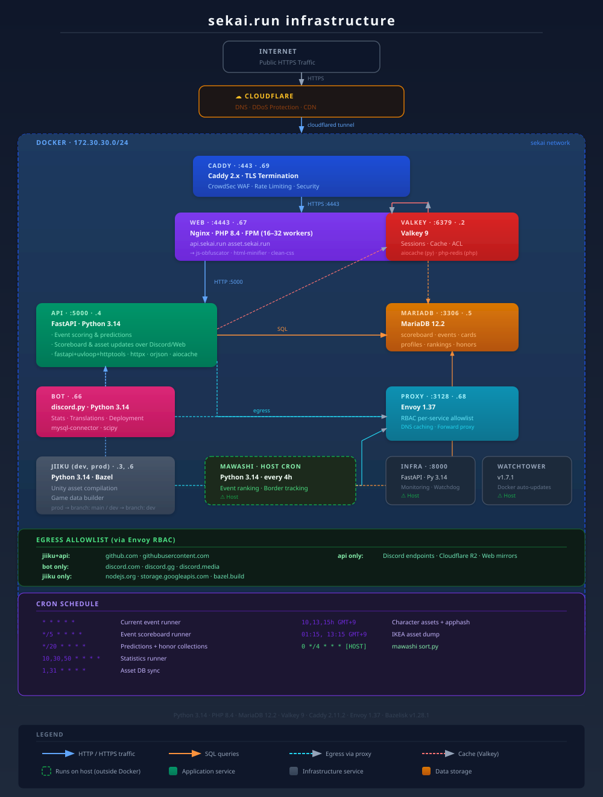

# sekai.run backend

Backend source code for sekai.run

Removed a lot of code. Do your own research.

The backend server runs on docker with [givsor](https://github.com/google/gvisor) enforced. some setups are very different from normal setups.

## Developers

- [lemonsour864](https://github.com/lemonsour864)
- [stypr](https://github.com/stypr)
- [t-wy](https://github.com/t-wy)
- [Jiiku831](https://github.com/Jiiku831)

## Architecture



## Notes

### `jiiku/`: Jiiku Python Bindings

This is a custom python bindings built specifically for Jiiku's team analysis and statistics.
You might want to read and change code appropriately, as some variables are bound to dev/prod domains. (jiiku-dev.internal / jiiku-prod.internal)

```
jiiku/
├── add_latest_master_db_version.sh: Fetch Sekai Viewer's Master DB and push it to your own DB versions
├── prod
│   ├── cache: Bazel build cache
│   ├── dist: Built files - main.py reads this folder
│   ├── Dockerfile: Dockerfile for patches
│   ├── patches: Specific patches for building python data
│   │   ├── BUILD.bazel
│   │   ├── build_python.sh
│   │   └── music_metas.json
│   └── server: Python binding server for Jiiku's sekai-public
│       ├── main.py: main loop
│       ├── server.py: server code
│       ├── pyproject.toml
│       └── uv.lock
├── sekai-modules
└── update_modules.sh: Automatic push cronjob for sekai-module
```


### `infra`: infra

We removed this code since it's not really something needed for sharing.

```
infra/
├── analytics.py: for traffic analysis
├── app.py: for automated builds on frontend
├── main.py: main loop
├── sekai-infra.service: systemd setttins
```
